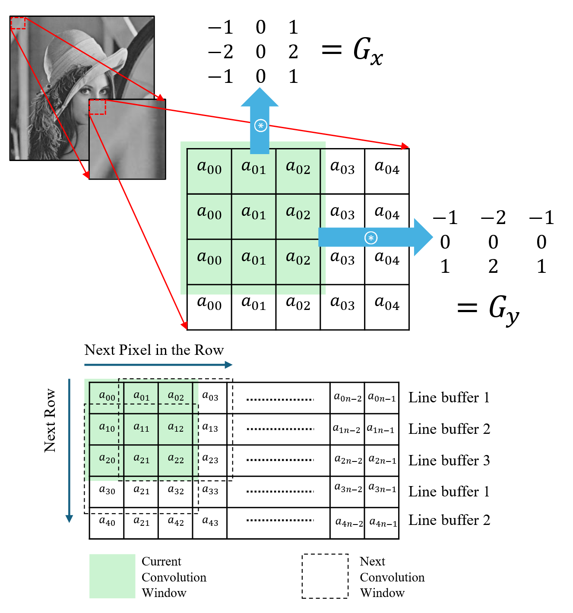
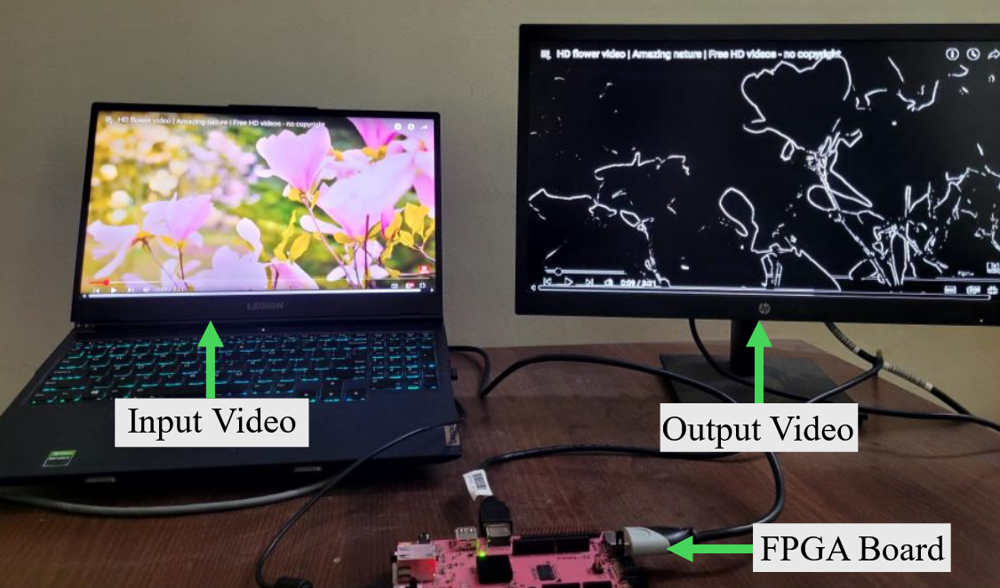

## 🧠 Sobel Filter IP (Verilog)

This repository contains a **Sobel Edge Detection** hardware implementation written in **Verilog HDL**.  
It performs real-time edge detection on video streams using the Sobel operator and is tested on an FPGA platform.

---

## 🧮 Sobel Convolution Window

Below is a visualization of how the 3×3 convolution window moves across the image:

---

## 🧪 FPGA Demonstration

The design was tested on an FPGA board with live video input from a laptop and edge-detected output on a monitor.

| Input Video | FPGA Output Video |
|--------------|------------------|
|  | Real-time Sobel edge detection output |

---

